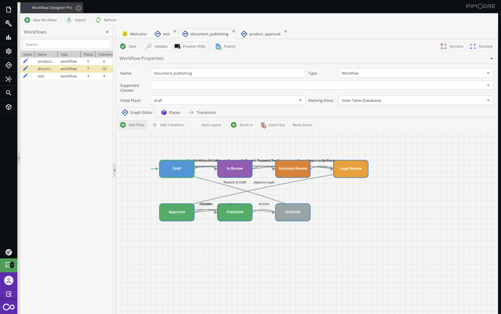

# Workflow Designer Pro Bundle

[](https://opensource.org/licenses/MIT)
[](https://pimcore.com/)

Visual Workflow Designer for Pimcore - Create, edit, and manage workflows with a graphical interface based on Symfony Workflow.



## Features

- 🎨 **Visual Graph Editor** - Drag-and-drop interface for creating workflow diagrams
- 📝 **Places & Transitions** - Full support for Pimcore workflow places and transitions
- 🔒 **Guard Expressions** - Visual editing of Symfony guard expressions
- 🔐 **Permission Rules** - Configure place permissions with conditions
- 📧 **Notifications** - Set up email/Pimcore notifications per transition
- 📤 **Import/Export** - YAML and JSON workflow import/export
- 🔄 **Version Control** - Track workflow changes with version history
- 🧪 **Simulation Mode** - Test workflows before publishing
- 📱 **Responsive UI** - Works on different screen sizes

## Requirements

- PHP >= 8.1
- Pimcore >= 11.0 or >= 2024.0
- Symfony >= 6.4

## Installation

### Via Composer

```bash
composer require praetorian-digital/workflow-designer-pro-bundle
```

### Enable the Bundle

Add to `config/bundles.php`:

```php
return [
    // ...
    PraetorianDigital\WorkflowDesignerProBundle\WorkflowDesignerProBundle::class => ['all' => true],
];
```

### Install Assets

```bash
bin/console assets:install --symlink
bin/console cache:clear
```

### Run the Installer

```bash
bin/console pimcore:bundle:install WorkflowDesignerProBundle
```

## Configuration

Create `config/packages/workflow_designer_pro.yaml`:

```yaml
workflow_designer_pro:
    storage_path: '%kernel.project_dir%/var/config/workflow_designer_pro'
    publish_path: '%kernel.project_dir%/config/workflows'
    max_versions: 10
    backup_enabled: true
    auto_cache_clear: true
```

Make sure your workflows are imported in `config/packages/workflows.yaml`:

```yaml
imports:
    - { resource: '../workflows/*.yaml' }
```

## Usage

### Accessing the Designer

1. Navigate to **Settings → Workflow Designer Pro** in Pimcore admin
2. Or use the top-level **Workflow Designer** menu item

### Creating a Workflow

1. Click **New Workflow**
2. Fill in the basic settings (name, label, supports)
3. Add places in the **Places** tab or Graph Editor
4. Add transitions connecting places
5. Configure guards and notifications as needed
6. **Save Draft** to store your work
7. **Publish** to activate the workflow

### Applying to Data Objects

In your workflow configuration, set the `supports` property:

```yaml
supports:
    - 'Pimcore\Model\DataObject\YourClass'
```

## Permissions

The bundle creates two permissions:

- `workflow_designer` - View and edit workflows
- `workflow_designer_publish` - Publish workflows to configuration

Assign these to users via **Settings → Users → Permissions**.

## Documentation

- [User Guide](docs/user-guide.md)

## Contributing

Contributions are welcome! Please read our [Contributing Guide](CONTRIBUTING.md) before submitting a Pull Request.

## License

This bundle is released under the MIT License. See the [LICENSE](LICENSE) file for details.

## Credits

Built with ❤️ for the Pimcore community.

Based on:
- [Pimcore Workflow Management](https://docs.pimcore.com/platform/Pimcore/Workflow_Management/)
- [Symfony Workflow Component](https://symfony.com/doc/current/workflow.html)

